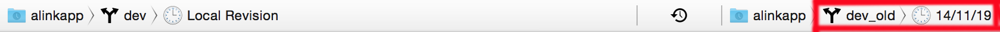

# 如何对比两个分支中的同一个文件

(1) 首先，将两个目标分支 checkout 到本地（假如本地分支命名为 A 和 B）。

(2) 其次，在 xcode 中打开分支A，并打开要比较的目标文件C。

(3) 然后，点击顶部工具条右侧的 Version Editor（下图红框所示），使编辑区会分为左右两部分（注：此时，两部分均会显示分支A中文件C的内容）。

(4) 最后，点击编辑区右下角的分支切换按钮（下图红框所示），选择分支B及相应的commit，即可在编辑区中高亮显示出差异。

