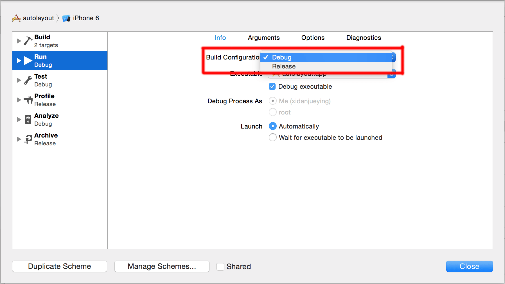
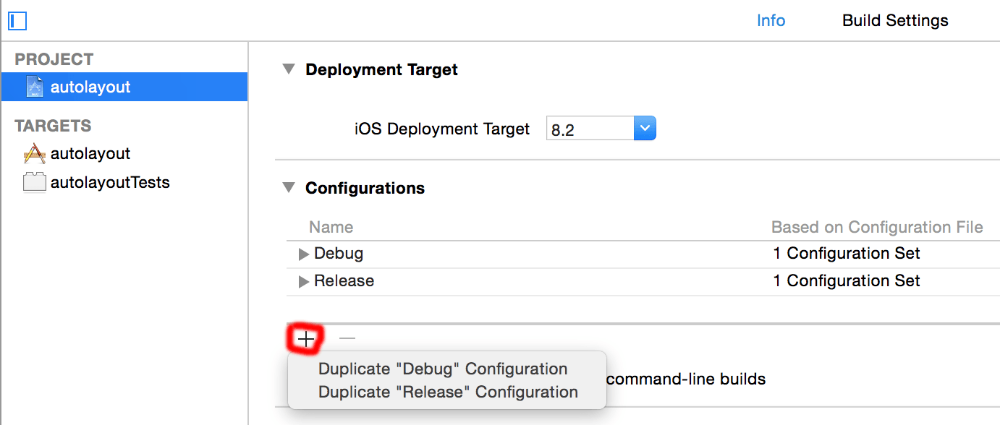

# 如何添加Build Configuration

### 一. 前言

我们在通过xcode build工程时，会先选择基于哪种Configuration来build，如下图：

那么这些Configuration是如何添加的呢？

 

### 二. 添加Configuration

选择 PROJECT -> Info -> Configurations，然后点击 "+" 即可添加一个Configuration，如下图：

