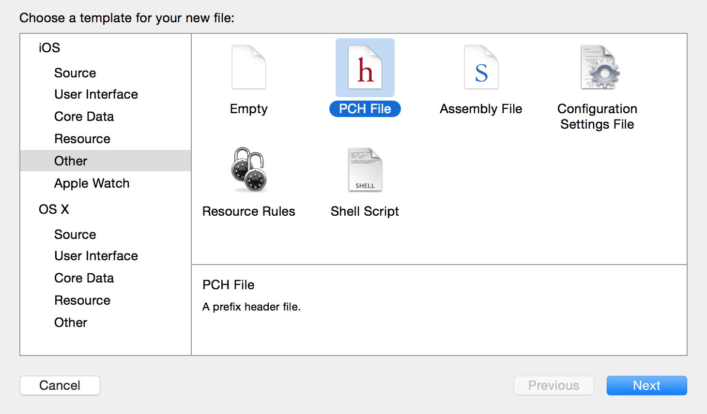
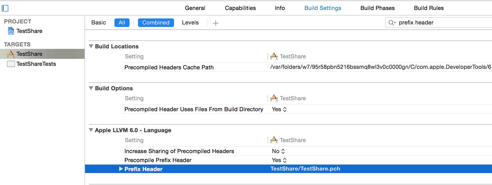

# 如何添加pch文件

### 一. 简介

> pch，全称为precompile header。在开发过程中，可以将那些在整个工程都广泛使用的头文件包含在该文件下，编译器就会自动将pch文件中的头文件添加到所有的源文件中，这样在需要使用相关类的时候无需import就可以直接使用头文件中的内容，给编程带来了很大的便利性。

 

### 二. 如何添加

(1) 首先，打开新建文件窗口（command + N）：iOS -> Other -> PCH file，创建一个pch文件。

(2) 其次，选择工程的 TARGETS -> Build Settings，搜索 `prefix header`，将上一步新建的pch文件的路径添加到该选项中。

(3) 最后，编译一遍，新添加的pch文件就可以使用了。
