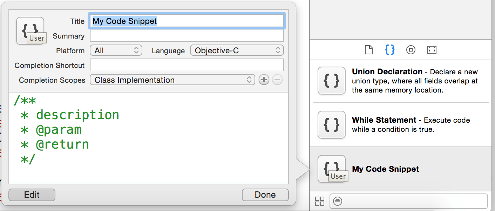
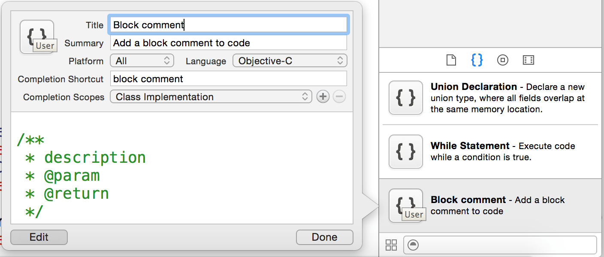
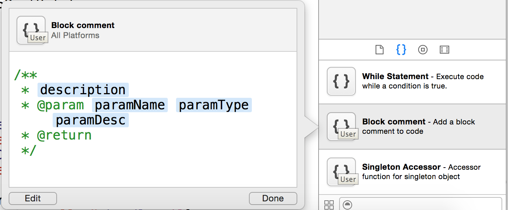

# 如何添加代码片段

(1) 选中目标代码片段，将其拖拽到工具条底部的代码片段区，此时会出现代码片段编辑窗口，如下图所示：

(2) 完善编辑窗口中的内容（添加一个块级注释片段），如下图所示：

> 注：上图中"completion shortcut"部分的内容，即为调用该代码片段的快捷方式，当你在编辑器中输入"block comment"并回车，就会生成代码片段。

(3) 如果代码片段中的有些内容是变化的，则可以使用 `<#TokenName#>` 来代替，上面的注释片段就属于这种情况，我们可以改写成这样：

	/**
	 * <#description#>
	 * @param <#paramName#> <#paramType#> <#paramDesc#>
	 * @return
	 */
	 
修改后的代码片段，最终会显示成这个样子：

